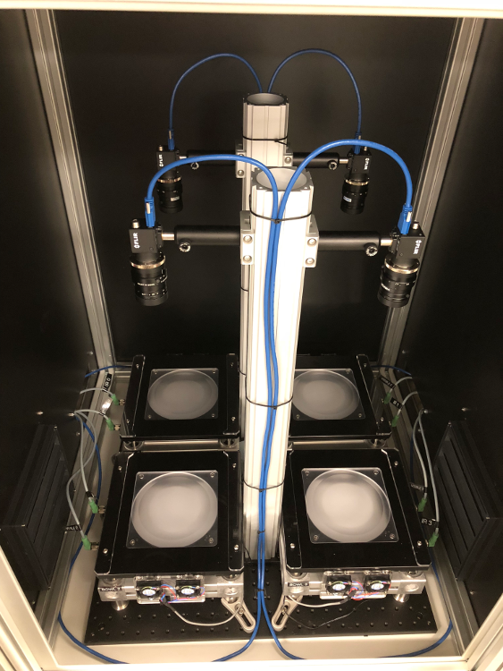

- [Repository Information](#org0db53be)
  - [Description](#org0acea5f)
- [Images](#org0d5f30a)
- [Schematic](#org35c31fb)
- [Gerbers](#org806ef14)
- [Bill of Materials](#orgb4d15ec)
  - [PCB Parts](#org1f9e314)
  - [Supplemental Parts](#org60655b2)
  - [Vendor Parts Lists](#org40b2724)
- [Supplemental Documentation](#org7a75c65)
  - [Assembly Instructions](#org80c2da5)

# Repository Information

-   **Name:** fly\_bowl\_wiring
-   **Version:** 1.0
-   **License:** Open-Source Hardware
-   **URL:** <https://github.com/janelia-kicad/fly_bowl_wiring>
-   **Author:** Peter Polidoro
-   **Email:** peterpolidoro@gmail.com

## Description

# Images

# Schematic

[./schematic/fly\_bowl\_wiring.pdf](./schematic/fly_bowl_wiring.pdf)

# Gerbers

# Bill of Materials

## PCB Parts

| Item | Reference(s)                                                | Quantity | PartNumber     | Vendor            | Description                         |
|---- |----------------------------------------------------------- |-------- |-------------- |----------------- |----------------------------------- |
| 1    | BL1 BL2 BL3 BL4                                             | 4        | MOBL\_150x150  | smartvisionlights | Maximum Operating Backlight 150x150 |
| 2    | CABLE1 CABLE2                                               | 2        | 1195-7211-ND   | digikey           | CABLE ASSY DB09 SHLD BEIGE 2M       |
| 3    | CABLE10 CABLE11 CABLE13 CABLE14 CABLE4 CABLE5 CABLE7 CABLE8 | 8        | 277-8345-ND    | digikey           | CBL FMALE RA TO MALE 5POS 1.5M      |
| 4    | CABLE12 CABLE3 CABLE6 CABLE9                                | 4        | GC14333-ND     | digikey           | USB3.0-A-USB3.0-MICRO-B 3M GOLD     |
| 5    | CAMERA1 CAMERA2 CAMERA3 CAMERA4                             | 4        | FL3-U3-13Y3M-C | flir              | 1280x1024 150 FPS Mono              |
| 6    | F1 F2 F3 F4 F5 F6 F7 F8                                     | 8        | 381-2367-ND    | digikey           | FAN AXIAL 40X10MM 24VDC WIRE        |
| 7    | J1                                                          | 1        | 277-2667-ND    | digikey           | CONN DSUB PLUG 9POS STR TERM BLK    |
| 8    | J2                                                          | 1        | 277-2668-ND    | digikey           | CONN DSUB RCPT 9POS STR TERM BLK    |
| 9    | L1 L2 L3 L4                                                 | 4        | 475-2864-2-ND  | digikey           | EMITTER IR 860NM 100MA SMD          |

## Supplemental Parts

| Item | Quantity | PartNumber  | Vendor  | Description                  |
|---- |-------- |----------- |------- |---------------------------- |
| 1    | 2        | 277-2684-ND | digikey | 9POS DSUB BACKSHELL          |
| 2    | 2        | 277-2767-ND | digikey | DSUB CAP NUT W/SEAL          |
| 3    | 2        | 277-2722-ND | digikey | DSUB CAP NUT W/SEAL          |
| 4    | 2        | A33692-ND   | digikey | CONN D-SUB FEMALE SCREW LOCK |

## Vendor Parts Lists

[./bom/digikey\_parts.csv](./bom/digikey_parts.csv)

[./bom/flir\_parts.csv](./bom/flir_parts.csv)

[./bom/smartvisionlights\_parts.csv](./bom/smartvisionlights_parts.csv)

[./bom/supplemental\_digikey\_parts.csv](./bom/supplemental_digikey_parts.csv)

# Supplemental Documentation

## Assembly Instructions
