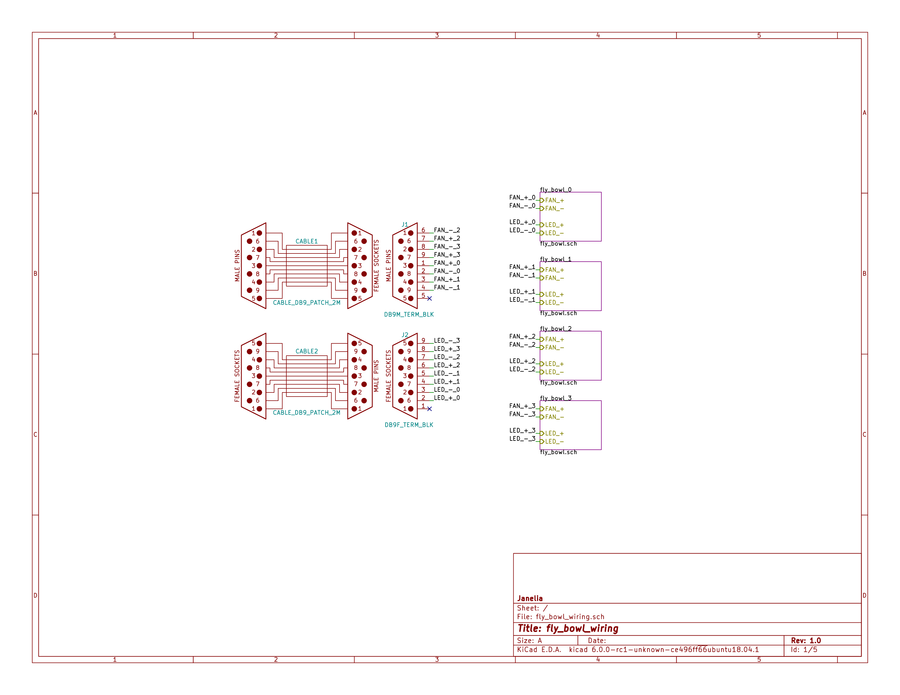
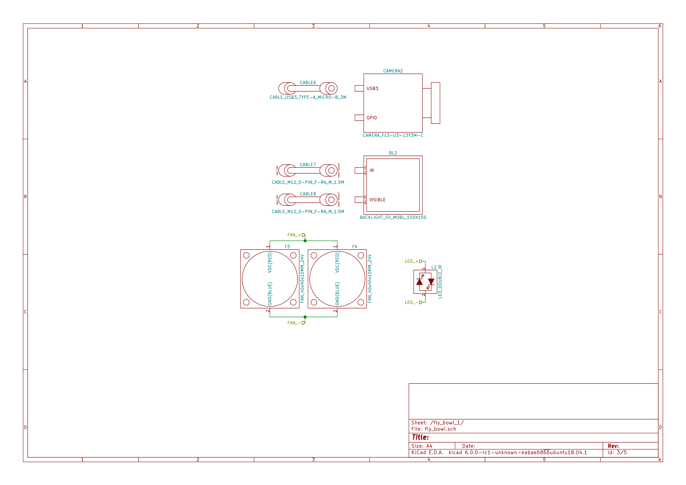
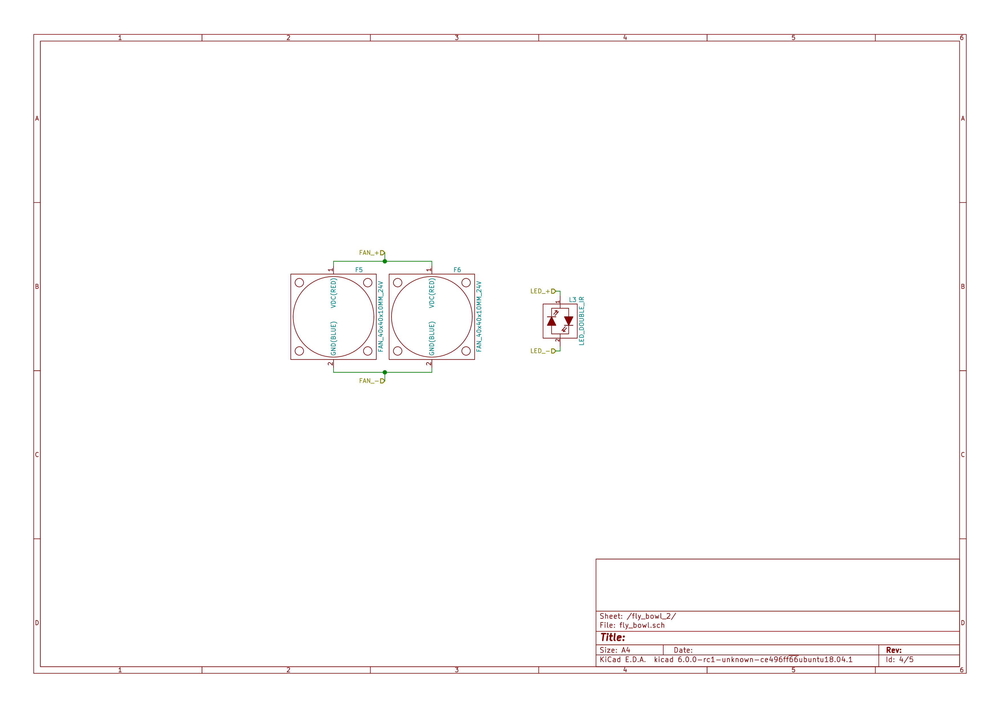
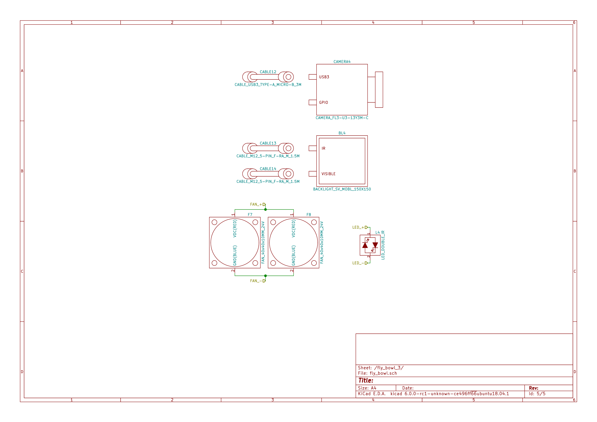

- [Repository Information](#org3a7e003)
  - [Description](#org6c6f387)
- [Images](#orge4f3e96)
- [Schematic](#orgc1eb895)
- [Gerbers](#orgd747a18)
- [Bill of Materials](#org899f177)
  - [PCB Parts](#orgc73b154)
  - [Supplemental Parts](#orge063737)
  - [Vendor Parts Lists](#orgae43a7f)
- [Supplemental Documentation](#org2a020da)
  - [Assembly Instructions](#org5a6685d)

# Repository Information

-   **Name:** fly\_bowl\_wiring
-   **Version:** 1.0
-   **License:** Open-Source Hardware
-   **URL:** <https://github.com/janelia-kicad/fly_bowl_wiring>
-   **Author:** Peter Polidoro
-   **Email:** peterpolidoro@gmail.com

## Description

# Images

# Schematic

[./schematic/fly\_bowl\_wiring.pdf](./schematic/fly_bowl_wiring.pdf)

# Gerbers

# Bill of Materials

## PCB Parts

|    |
|--- |
|  |

## Supplemental Parts

| Item | Quantity | PartNumber  | Vendor  | Description                  |
|---- |-------- |----------- |------- |---------------------------- |
| 1    | 2        | 277-2684-ND | digikey | 9POS DSUB BACKSHELL          |
| 2    | 2        | 277-2767-ND | digikey | DSUB CAP NUT W/SEAL          |
| 3    | 2        | 277-2722-ND | digikey | DSUB CAP NUT W/SEAL          |
| 4    | 2        | A33692-ND   | digikey | CONN D-SUB FEMALE SCREW LOCK |

## Vendor Parts Lists

[./bom/digikey\_parts.csv](./bom/digikey_parts.csv)

[./bom/flir\_parts.csv](./bom/flir_parts.csv)

[./bom/smartvisionlights\_parts.csv](./bom/smartvisionlights_parts.csv)

[./bom/supplemental\_digikey\_parts.csv](./bom/supplemental_digikey_parts.csv)

# Supplemental Documentation

## Assembly Instructions
